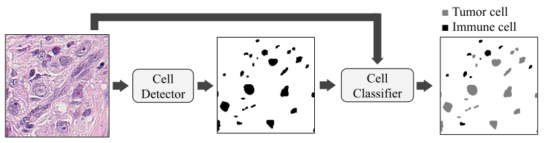

# histosnet
This is the project for my master's thesis. The goal is to find new biomarkers for local recurrence in cases of triple-negative breast cancer. A possible biomarker is the spatial distribution of tumor-infiltrating lymphocytes. To investigate this I'm using a U-Net trained on public datasets to segment and classify cells on whole-slide images of triple-negative breast cancer tissue. This work was started by [Patrik Laurell](https://github.com/patriklaurell) and [Diwght Lidman](https://github.com/dwilid).

## Abstract
Breast cancer is the most common cancer in women. Triple-negative breast cancer affects 10% of breast cancer patients and is associated with an especially bad prognosis. Today, tissue slides are assessed manually by a clinician to set a prognosis. However, the prediction of outcomes could be improved using machine learning. A U-Net was trained on public data and was used to detect cells in microscopic images of  H\&E-stained triple-negative breast cancer tissue. The detected cells were then classified using logistic regression. The detected cells served as a basis for the prediction of local relapse, distant relapse, and overall fatality in a cohort of 155 patients diagnosed with triple-negative breast cancer. The accuracy of models fitted to features extracted using machine learning was compared to the accuracy of models fitted to features estimated by a clinician. The featured extracted using machine learning was found to yield as good, or better, predictions compared to estimated features. A high number of tumor-infiltrating lymphocytes was associated with a better prognosis. This shows that machine learning can be used to find biomarkes in microscopic tissue images and use these to predict outcomes in cancer patients.

## Project Overview
The aim is to find new biomarkers in tissue images for assessing the outcome of patients diagnosed with TNBC. New biomarkers could be used to aid clinical decision making, both manually or by using models. High-level features, such as the number of immune cells and their locations, are extracted from tissue images using machine learning. The prognostic power of these featured are then evaluated by measuring how well they can predict an outcome. An overview of this procedure can be seen below.

Two machine learning models are used for feature extraction. The first one, the cell detector, is used for detecting cells in tissue images. This model is a U-Net trained on a large set of public data. The output from this model is a segmentation map showing the location and mask of every cell. The second model, the cell classifier, is a logistic regression model that used an image and its mask to classify every detected cell as tumor cell or immune cell. The cell detector was trained on a small number of manually annotated samples.

The amount of tumor cells and immune cells and their spacial distribution can then be extracted. These are the main features used in the search for bio-markers in a cohort of 155 TNBC patients.

## Data
These are the datasets used in the project

### MoNuSeg
* [Download](https://monuseg.grand-challenge.org/Data/)
This dataset was used in the 2028 MoNuSeg Challenge.
* 30 images of cancer tissue from various organs
* 1000 x 1000 pixels
* 40x magnification
* 22,000 cells annotated.

### Bns
This dataset was used by [(N. Peter 2017)](https://ieeexplore.ieee.org/document/7950669). Way fewer cells in this dataset, on the other hand it's much closer to the target domain. [Download](http://members.cbio.mines-paristech.fr/~pnaylor/BNS.zip)
* 33 images of triple-negeative breast cancer tissue. The annotations can be found [here](https://wiki.cancerimagingarchive.net/display/DOI/Dataset+of+Segmented+Nuclei+in+Hematoxylin+and+Eosin+Stained+Histopathology+Images) and the WSIs can be found at [The Cancer Genome Atlas](https://cancergenome.nih.gov/)
* 512 x 512 pixels
* 40x magnification
* 2758 cells annotated.

### [Quip]()
This dataset was created by [(L. Hou et al. 2020)](https://www.nature.com/articles/s41597-020-0528-1). It's very large. The slides are easiest downloaded using the [GDC Data Transfer Tool](https://gdc.cancer.gov/access-data/gdc-data-transfer-tool) with the manifest `data/quip/gdc_manifest.2020-09-29.txt`. The annotations have to be downloaded manually. Links to the annotation can be found here: [cancerimagingarchive.net](https://wiki.cancerimagingarchive.net/display/DOI/Dataset+of+Segmented+Nuclei+in+Hematoxylin+and+Eosin+Stained+Histopathology+Images)
* 5 billion annotated cells for various cancer types, breast included.
* 40x magnification.
* consists of WSIs but the annotations are made in 4000 x 4000 patches.
